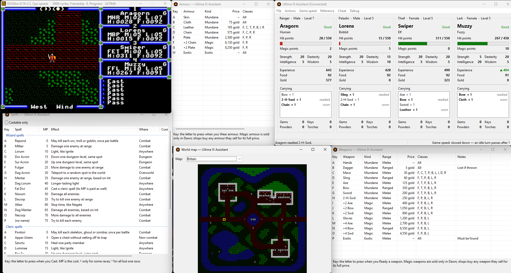
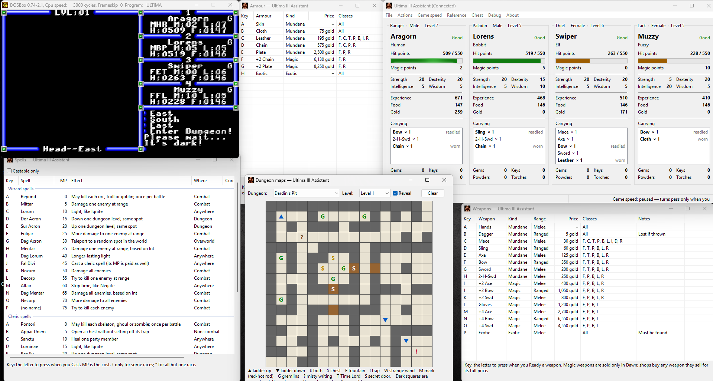

# Ultima III Assistant

Live party stats and inventory for **Ultima III: Exodus** (the GOG DOS release
running under DOSBox classic or DOSBox Staging), read straight out of the emulator's memory while you play.
It prefers [DOSBox Staging](https://www.dosbox-staging.org/)'s HTTP API and
falls back to reading the DOSBox process's memory directly.

Features:
- Main window shows details about each party member, including their inventories.
	- EXP indicator highlights when level up is available from Richard British.
	- Drag and drop interface allows you to move items between characters.
	- Wear and ready items directly from your inventory; equipment a shop unequips on a sale is put back.
	- Pool gold or distribute food evenly between your characters.
	- Cheat menu for healing, curing and resurrecting.
	- Game speed menu to shorten, lengthen or pause the wait before the game passes a turn by itself.
- Map window for displaying world and dungeon maps.
	- Indicates player's current position with a blinky cursor.
	- Allows browsing other maps than the one you're currently in.
	- Traces dungeons during discovery or discovers the whole map; exploration progress can be rolled back.
- Reference windows with spell, weapon and armor information.
	- Display full information about items and spells.
	- Spell list can dynamically limit spells to show only those castable by current active character.
	- Item lists show which character can use given item when hovering over that item's row.
- Open windows and their positions are remembered between runs.

## Screenshots

The assistant beside the game in DOSBox, with the Spells, Armour and Weapons
reference windows and the world map following the party through Britain:

The Dungeon maps window showing a whole level of Dardin's Pit with **Reveal** on:

## Download

Get `ultima3-assistant-<version>-win64.zip` from
[Releases](https://github.com/kylofon/ultima3-assistant/releases), unzip it
anywhere and run `Ultima III Assistant.exe`. Start the game before or after; the
assistant finds it by itself. The zip also has the DLLs the app needs and the
`staging` folder for playing in DOSBox Staging (see below). On Linux, build it
from source for now.

## Details

**Ultima III Assistant** is a [wxWidgets](https://www.wxwidgets.org/) app in
[`app/`](app/), built on the platform-neutral core in [`core/`](core/). Its
[README](app/README.md) covers every menu and window, how to build it, and the
few differences between Windows and Linux.

It finds the party block by signature scan, so it works whatever address DOSBox
happens to allocate, and keeps retrying until the game is running.

To play in DOSBox Staging 0.83+ with its API on, run the launcher for your
system from [`staging/`](staging/): `Play in DOSBox Staging.cmd` on Windows,
which uses the GOG install's config files unchanged, or
`play-in-dosbox-staging.sh` on Linux, which writes its own. Both add
`staging/assistant.conf`, which turns the API on. See
[Connecting to the game](app/README.md#connecting-to-the-game).

The reverse-engineered `PARTY.ULT` / in-memory layout (BCD fields, item tables,
header) is documented in [`app/README.md`](app/README.md#data-layout).

## Requirements

* Windows or Linux
* DOSBox Staging 0.83 or later is recommended; GOG's bundled DOSBox 0.74 works
  too, though only on Windows
* To build: CMake, a C++17 compiler and wxWidgets 3.2 (see
  [app/README.md](app/README.md#building))
* [cpp-httplib](https://github.com/yhirose/cpp-httplib) 0.56.0 (MIT), vendored in
  `core/third_party/cpp-httplib`

GitHub Actions ([`.github/workflows/build.yml`](.github/workflows/build.yml))
builds every push: the core on Linux, linked into a small smoke check that it
runs, and the Windows build with MSYS2; the Linux build is also started on a
virtual screen. The Windows exe and the DLLs beside it are attached to each run
for 14 days.

## License

Ultima III Assistant is MIT licensed (see `LICENSE`). *Ultima III: Exodus* is © Origin Systems / Electronic Arts;
its files are not part of this repository or the releases. The app icon is the Golem tile (`0x68`) from the
VGA tileset by Joshua Steele that ships with the Exodus Project's Ultima III Upgrade, and isn't covered by the
MIT licence. cpp-httplib keeps its own MIT licence.

## Support

https://buymeacoffee.com/krzysztofkania
